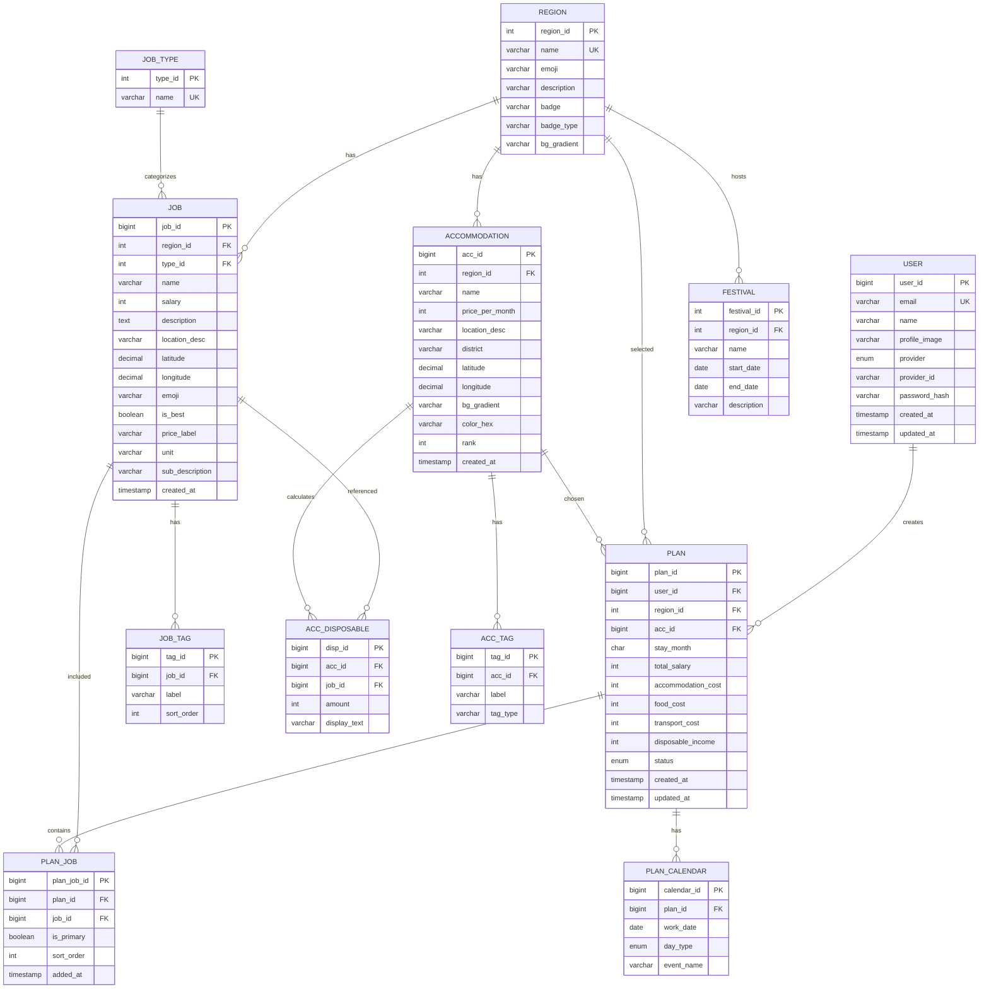

# ERD

This document summarizes the MariaDB schema used for local schema initialization.

Source SQL:

```text
src/main/resources/schema/mariadb/01_schema.sql
src/main/resources/schema/mariadb/02_seed.sql
```

Reference ERD draft:

```text
src/main/resources/reference/ERD.md
```

## Entity Relationship Diagram



## Application Login Table

The current Spring login flow uses the JPA entity table named `users`.

For local login testing, seed data inserts BCrypt password hashes into `users`.

```text
planner@samteo.local / 1234
admin@samteo.local   / 1234
```

The uppercase `USER` table exists because it is part of the drafted ERD schema.
