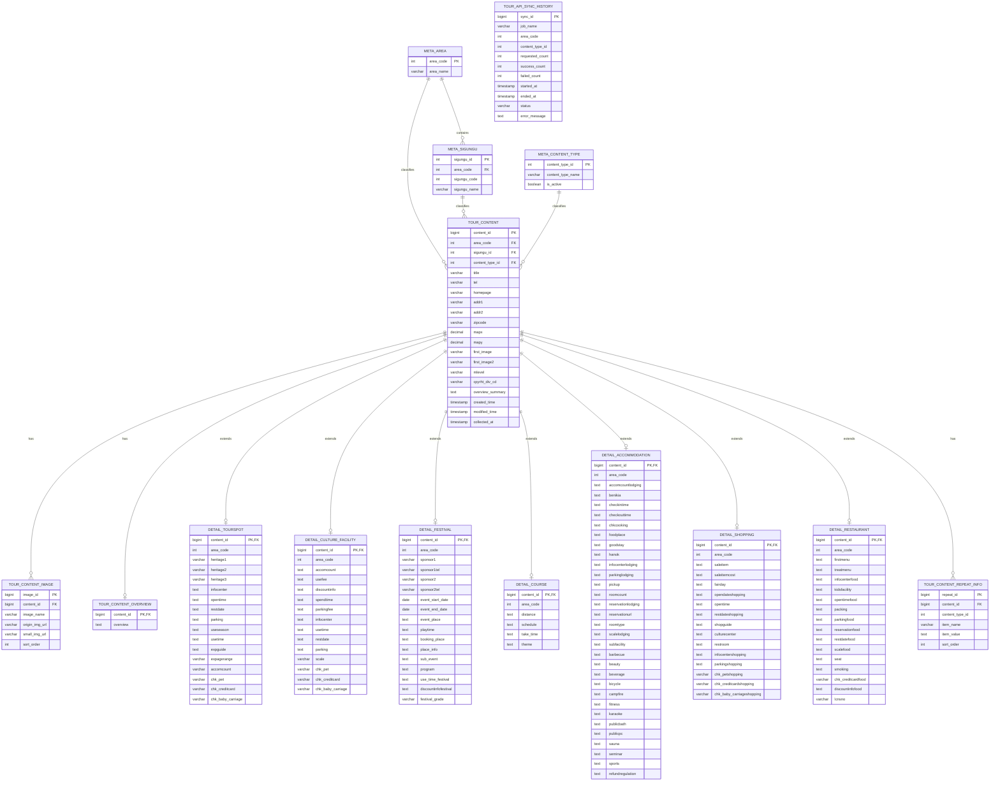

# 관광 데이터 ERD 초안

이 문서는 현재 로컬 SQL에 들어가 있는 대구 더미 스키마 설명이 아니라, `doc/SCHEMA/TourAPI-ERD.md`를 기준으로 다시 잡은 **목표 관광 데이터 ERD 초안**입니다.

전제는 다음과 같습니다.

- 적재 범위는 대구 한정이 아니라 **전국 단위**입니다.
- TourAPI 전체를 그대로 복제하지 않고, **우리 서비스에서 실제 활용할 컬럼만 선별 적재**합니다.
- 직업 데이터는 아직 별도 명세가 없으므로 이번 ERD에서는 **관광 데이터 영역만 우선 확정**합니다.
- 현재 구현 SQL의 `REGION`, `FESTIVAL`, `ACCOMMODATION` 같은 더미 테이블 구조는 최종안이 아니며, 아래 관광 중심 구조로 재편하는 것을 전제로 합니다.

## 이번 초안의 핵심 변경점

기존 초안 대비 방향은 아래와 같습니다.

1. `REGION` 중심 구조를 `meta_area`, `meta_sigungu` 기준 구조로 변경
2. `FESTIVAL`, `ACCOMMODATION` 같은 개별 도메인 테이블을 없애고 `tour_content` 하위 타입으로 통합
3. 전국 단위 수집을 위해 시도/시군구 기준 코드 테이블을 분리
4. TourAPI 공통 정보와 타입별 상세 정보를 분리
5. 이미지, 반복 상세, 소개 정보처럼 확장 가능한 영역은 별도 테이블로 분리

## 설계 원칙

- `tour_content`는 모든 관광 콘텐츠의 마스터 테이블입니다.
- 타입별 상세 정보는 `content_id` 기준 1:0..1 구조로 분리합니다.
- 전국 단위 조회를 위해 `area_code`, `sigungu_code`를 공통 보관합니다.
- TourAPI 응답 중 가변성이 큰 텍스트는 우선 `TEXT` 계열로 넉넉히 받고, 서비스 확정 후 정규화합니다.
- API에서 내려오는 콘텐츠 타입은 일단 `12, 14, 15, 25, 32, 38, 39` 위주로 적재합니다.
- 레포츠(`28`)는 당장 제외 가능하지만, 후속 편입 가능성을 열어둔 구조로 둡니다.

## 권장 엔터티

### 메타 영역

- `meta_area`: 시도 코드
- `meta_sigungu`: 시군구 코드
- `meta_content_type`: TourAPI 콘텐츠 타입 코드

### 마스터 영역

- `tour_content`: 공통 관광 콘텐츠
- `tour_content_image`: 콘텐츠 이미지
- `tour_content_overview`: 소개/개요 원문

### 상세 영역

- `detail_tourspot`: 관광지
- `detail_culture_facility`: 문화시설
- `detail_festival`: 축제/공연/행사
- `detail_course`: 여행코스
- `detail_accommodation`: 숙박
- `detail_shopping`: 쇼핑
- `detail_restaurant`: 음식점

### 확장 영역

- `tour_content_repeat_info`: 반복 상세 항목
- `tour_api_sync_history`: 배치/수집 이력

## ERD

## 테이블 역할 요약

| 테이블 | 역할 | 비고 |
| --- | --- | --- |
| `meta_area` | 전국 시도 코드 관리 | 전국 단위 필수 |
| `meta_sigungu` | 시군구 코드 관리 | 지역 세분화 조회용 |
| `meta_content_type` | TourAPI 콘텐츠 타입 기준값 | 적재 대상 타입 관리 |
| `tour_content` | 공통 마스터 | 모든 콘텐츠의 중심 |
| `tour_content_image` | 이미지 다건 저장 | 메인 이미지 외 추가 이미지 대응 |
| `tour_content_overview` | 소개 원문 저장 | 긴 본문 분리 |
| `detail_*` | 타입별 상세 | 타입별 1:0..1 |
| `tour_content_repeat_info` | 반복 상세 항목 | API별 가변 구조 완충 |
| `tour_api_sync_history` | 배치 이력 | 운영/장애 추적용 |

## 기존 더미 구조에서 바뀌는 점

### 1. `REGION`

- 기존: 대구 구 단위 더미 지역 테이블
- 변경: `meta_area` + `meta_sigungu`
- 이유: 실제 서비스는 전국 단위이며, TourAPI 기준 코드 체계를 그대로 활용하는 편이 맞음

### 2. `FESTIVAL`

- 기존: 독립 테이블
- 변경: `tour_content` + `detail_festival`
- 이유: 축제도 TourAPI 콘텐츠 타입 중 하나라 공통 필드와 상세 필드를 분리하는 편이 일관적임

### 3. `ACCOMMODATION`

- 기존: 생활비 계산용 독립 숙소 테이블
- 변경: `tour_content` + `detail_accommodation`
- 이유: 숙박 역시 TourAPI 콘텐츠 타입으로 관리 가능하며, 관광 데이터 적재 기준에서는 단일 모델이 적합함

### 4. `JOB`, `PLAN`

- 현재 문서에서는 제외
- 이유: 직업 데이터 명세가 아직 없고, 관광 적재 ERD와 별도 축으로 설계하는 편이 안전함
- 이후 권장: `tour_content`와 직접 합치지 말고, 서비스 도메인 테이블로 별도 연결

## 구현 우선순위 제안

1. `meta_area`, `meta_sigungu`, `meta_content_type`
2. `tour_content`
3. `tour_content_overview`, `tour_content_image`
4. `detail_festival`, `detail_accommodation`, `detail_restaurant`, `detail_shopping`
5. `detail_tourspot`, `detail_culture_facility`, `detail_course`
6. `tour_content_repeat_info`, `tour_api_sync_history`

## 아직 확정하지 않은 부분

- `sigungu_code`를 PK로 둘지, `(area_code, sigungu_code)` 복합 유니크로 둘지
- 레포츠(`content_type_id = 28`)를 이번 배치에 포함할지
- 반복 응답을 JSON으로 둘지 `tour_content_repeat_info`로 완전히 펼칠지
- 이미지 테이블을 별도 둘지, 우선 메인 이미지만 `tour_content`에 둘지
- 이후 직업/플랜 도메인에서 관광 콘텐츠를 어떤 방식으로 참조할지

## 현재 기준 추천 결론

지금 단계에서는 `tour_content` 중심의 **관광 공통 마스터 + 타입별 상세 분리 구조**로 가는 것이 가장 안전합니다.  
즉, 기존 `REGION/FESTIVAL/ACCOMMODATION` 중심 ERD를 유지하기보다, TourAPI의 `content_id`, `content_type_id`, `area_code`를 중심으로 재편한 뒤 나중에 직업/플랜 도메인을 얹는 방식이 맞습니다.
