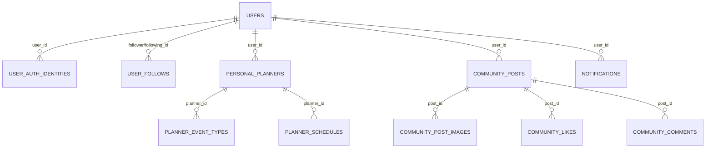

# 현재 서비스 스키마

최종 갱신일: 2026-07-01

## 테이블 목록

| 영역 | 테이블 | 설명 |
| --- | --- | --- |
| 회원 | `users` | 서비스 사용자 |
| 인증 | `user_auth_identities` | 로그인 공급자 연결 |
| 인증 | `oauth_pending_identities` | OAuth 계정 연결 대기 |
| 관계 | `user_follows` | 팔로우 관계 |
| 지역 | `meta_region` | 지역 메타데이터 |
| 플래너 원천 | `jobs` | 일자리 |
| 플래너 원천 | `accommodations` | 숙소 |
| 내 플래너 | `personal_planners` | 사용자 플래너 |
| 내 플래너 | `planner_event_types` | 사용자 일정 유형 |
| 내 플래너 | `planner_default_event_types` | 기본 일정 유형 |
| 내 플래너 | `planner_schedules` | 일정 항목 |
| 커뮤니티 | `community_posts` | 게시글 |
| 커뮤니티 | `community_post_images` | 게시글 이미지 |
| 커뮤니티 | `community_likes` | 좋아요 |
| 커뮤니티 | `community_comments` | 댓글 |
| 알림 | `notifications` | 최근 24시간 알림 |

## 논리 관계

## FK 운영 원칙

- 다이어그램의 선은 조회를 위한 논리 관계이다.
- 신규 `notifications`, `user_auth_identities`, `oauth_pending_identities`는 물리 FK 없이 ID와 인덱스로 연결한다.
- 기존 커뮤니티 일부 테이블에는 과거 작성된 물리 FK가 남아 있다.
- 신규 기능은 삭제·배포 유연성을 위해 FK보다 서비스 검증과 JOIN/ID 조회를 우선한다.
- FK를 제거하는 별도 마이그레이션 없이 기존 제약을 임의 변경하지 않는다.

## 알림 테이블 핵심 컬럼

| 컬럼 | 설명 |
| --- | --- |
| `user_id` | 수신 사용자 ID |
| `actor_user_id` | 행동 사용자 ID, 시스템 알림은 NULL |
| `type` | 알림 유형 |
| `target_type`, `target_id` | 이동 대상의 논리 식별자 |
| `dedupe_key` | 같은 사건 중복 방지 키 |
| `read_at` | 읽음 시각, NULL이면 미확인 |
| `created_at` | 발생 시각 |
| `expires_at` | 만료 시각 |

인덱스는 사용자별 최신 조회, 미확인 집계, 만료 정리를 기준으로 구성한다.
