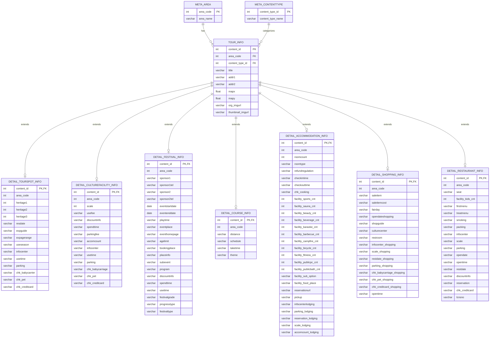

# 관광 웹앱 데이터 적재 문서

## 개요

본 프로젝트는 한국관광공사 TourAPI 기반 관광 데이터를 수집하고, 분석 및 서비스 활용이 가능한 형태로 적재하는 것을 목표로 합니다.

데이터 구조는 크게 다음 3개 영역으로 나뉩니다.

1. `meta` 영역
   지역 코드, 관광 콘텐츠 타입과 같은 기준 정보를 관리합니다.
2. `master` 영역
   모든 관광 공통 정보를 `tour_info` 테이블에 통합 저장합니다.
3. `detail` 영역
   콘텐츠 타입별 상세 속성을 개별 테이블로 분리 저장합니다.

---

## 데이터 소스

- 공공데이터포털 / 한국관광공사 TourAPI
- 수집 방식: OpenAPI 호출
- 적재 대상: 메타 정보, 관광 공통 정보, 관광 타입별 상세 정보
- 주요 식별자:
  - `area_code`: 지역 식별자
  - `content_type_id`: 관광 타입 식별자
  - `content_id`: 개별 관광 콘텐츠 식별자

---

## 메타 데이터

### 메타 테이블 적재 대상

| 테이블 | PK | 설명 | 적재 방식 |
| --- | --- | --- | --- |
| `meta_area` | `area_code` | 지역 코드 기준 정보 | 초기 메타 적재 |
| `meta_contenttype` | `content_type_id` | 관광 콘텐츠 타입 기준 정보 | 초기 메타 적재 |

### `meta_area`

| column | type | description |
| --- | --- | --- |
| area_code | Integer | 지역 코드 |
| area_name | varchar | 지역명 |

| area_name | area_code |
| --- | --- |
| 서울 | 1 |
| 인천 | 2 |
| 대전 | 3 |
| 대구 | 4 |
| 광주 | 5 |
| 부산 | 6 |
| 울산 | 7 |
| 세종특별자치시 | 8 |
| 경기도 | 31 |
| 강원특별자치도 | 32 |
| 충청북도 | 33 |
| 충청남도 | 34 |
| 경상북도 | 35 |
| 경상남도 | 36 |
| 전북특별자치도 | 37 |
| 전라남도 | 38 |
| 제주특별자치도 | 39 |

### `meta_contenttype`

| column | type | description |
| --- | --- | --- |
| content_type_id | Integer | 관광 콘텐츠 타입 코드 |
| content_type_name | varchar | 관광 콘텐츠 타입명 |

| content_type_name | content_type_id |
| --- | --- |
| 관광지 | 12 |
| 문화시설 | 14 |
| 축제공연행사 | 15 |
| 여행코스 | 25 |
| 레포츠 | 28 |
| 숙박 | 32 |
| 쇼핑 | 38 |
| 음식점 | 39 |

---

## ERD 구조

### 설계 원칙

- `tour_info`는 모든 관광 데이터의 기준이 되는 마스터 테이블입니다.
- 상세 테이블은 `content_id`를 기준으로 `tour_info`와 1:1 또는 1:0..1 관계를 가집니다.
- `area_code`, `content_type_id`는 조회 성능 및 검증 편의를 위해 상세 테이블에도 함께 보관합니다.
- `meta_area`, `meta_contenttype`는 코드성 기준 테이블로 사용합니다.

### ERD

### 엔터티별 관계 설명

| 엔터티 | PK | 주요 FK | 역할 |
| --- | --- | --- | --- |
| `meta_area` | `area_code` | - | 지역 기준 정보 |
| `meta_contenttype` | `content_type_id` | - | 관광 타입 기준 정보 |
| `tour_info` | `content_id` | `area_code`, `content_type_id` | 전체 관광 데이터의 마스터 테이블 |
| `detail_tourspot_info` | `content_id` | `content_id -> tour_info.content_id` | 관광지 상세 정보 |
| `detail_culturefacility_info` | `content_id` | `content_id -> tour_info.content_id` | 문화시설 상세 정보 |
| `detail_festival_info` | `content_id` | `content_id -> tour_info.content_id` | 축제/행사 상세 정보 |
| `detail_course_info` | `content_id` | `content_id -> tour_info.content_id` | 여행코스 상세 정보 |
| `detail_accommodation_info` | `content_id` | `content_id -> tour_info.content_id` | 숙박 상세 정보 |
| `detail_shopping_info` | `content_id` | `content_id -> tour_info.content_id` | 쇼핑 상세 정보 |
| `detail_restaurant_info` | `content_id` | `content_id -> tour_info.content_id` | 음식점 상세 정보 |

### 관계 상세

| 부모 테이블 | 자식 테이블 | 관계 | 설명 |
| --- | --- | --- | --- |
| `meta_area` | `tour_info` | 1:N | 하나의 지역 코드에 여러 관광 데이터가 매핑됨 |
| `meta_contenttype` | `tour_info` | 1:N | 하나의 콘텐츠 타입에 여러 관광 데이터가 매핑됨 |
| `tour_info` | `detail_tourspot_info` | 1:0..1 | 관광지 타입일 때만 상세 정보 존재 |
| `tour_info` | `detail_culturefacility_info` | 1:0..1 | 문화시설 타입일 때만 상세 정보 존재 |
| `tour_info` | `detail_festival_info` | 1:0..1 | 축제/행사 타입일 때만 상세 정보 존재 |
| `tour_info` | `detail_course_info` | 1:0..1 | 여행코스 타입일 때만 상세 정보 존재 |
| `tour_info` | `detail_accommodation_info` | 1:0..1 | 숙박 타입일 때만 상세 정보 존재 |
| `tour_info` | `detail_shopping_info` | 1:0..1 | 쇼핑 타입일 때만 상세 정보 존재 |
| `tour_info` | `detail_restaurant_info` | 1:0..1 | 음식점 타입일 때만 상세 정보 존재 |

### 관계 요약

| parent table | child table | relation | description |
| --- | --- | --- | --- |
| `meta_area` | `tour_info` | 1:N | 하나의 지역은 여러 관광 데이터를 가질 수 있음 |
| `meta_contenttype` | `tour_info` | 1:N | 하나의 콘텐츠 타입은 여러 관광 데이터를 가질 수 있음 |
| `tour_info` | 각 상세 테이블 | 1:1 | 콘텐츠 타입별 상세 정보 저장 |

---

## 테이블별 적재 정책

### 1. Master Table: `tour_info`

모든 관광 타입 공통 정보를 저장하는 기준 테이블입니다.

| column | description |
| --- | --- |
| area_code | 지역 코드 |
| content_type_id | 관광 타입 코드 |
| content_id | 콘텐츠 고유 ID |
| title | 관광지명 / 시설명 / 업장명 |
| addr1, addr2 | 주소 |
| mapx, mapy | 좌표 |
| org_imgurl | 원본 이미지 |
| thumbnail_imgurl | 썸네일 이미지 |

#### 적재 흐름

- Extract
  - 지역(`area_code`)과 관광 타입(`content_type_id`) 조합으로 목록 API 호출
- Transform
  - 공통 필드만 선별
  - 좌표, 주소, 이미지 URL 정규화
  - 중복 `content_id` 제거
- Load
  - `tour_info` upsert
  - 이후 상세 테이블 적재의 기준 데이터로 사용

---

## 상세 테이블 적재 대상

### `detail_tourspot_info` (`content_type_id = 12`)

관광지 상세 정보 저장

| 구분 | 컬럼 | 설명 |
| --- | --- | --- |
| 식별 | `content_id`, `area_code` | 마스터 데이터와 연결되는 기준 키 |
| 문화재 | `heritage1`, `heritage2`, `heritage3` | 문화재 관련 구분 값 |
| 체험/이용 | `resdate`, `expguide`, `expagerange`, `useseason` | 체험 가능 시기, 연령, 안내 정보 |
| 운영 | `infocenter`, `usetime`, `parking` | 문의처, 이용 시간, 주차 정보 |
| 편의 | `chk_babycarrier`, `chk_pet`, `chk_creditcard` | 유모차, 반려동물, 카드 사용 가능 여부 |

### `detail_culturefacility_info` (`content_type_id = 14`)

문화시설 상세 정보 저장

| 구분 | 컬럼 | 설명 |
| --- | --- | --- |
| 식별 | `content_id`, `area_code` | 마스터 데이터와 연결되는 기준 키 |
| 운영 규모 | `scale`, `accomcount` | 시설 규모 및 수용 가능 인원 |
| 비용 | `usefee`, `discountinfo`, `parkingfee` | 이용 요금, 할인, 주차 요금 |
| 운영 정보 | `spendtime`, `infocenter`, `usetime`, `parking` | 관람 시간, 문의처, 운영 및 주차 정보 |
| 편의 | `chk_babycarriage`, `chk_pet`, `chk_creditcard` | 유모차, 반려동물, 카드 사용 가능 여부 |

### `detail_festival_info` (`content_type_id = 15`)

축제/공연/행사 상세 정보 저장

| 구분 | 컬럼 | 설명 |
| --- | --- | --- |
| 식별 | `content_id`, `area_code` | 마스터 데이터와 연결되는 기준 키 |
| 주최 정보 | `sponsor1`, `sponsor1tel`, `sponsor2`, `sponsor2tel` | 주최/주관 기관 및 연락처 |
| 행사 일정 | `eventstartdate`, `eventenddate`, `playtime` | 행사 시작일, 종료일, 공연 시간 |
| 행사 위치 | `eventplace`, `eventhomepage` | 행사 장소 및 홈페이지 |
| 관람/예매 | `agelimit`, `bookingplace`, `discountinfo` | 관람 연령, 예매처, 할인 정보 |
| 프로그램 | `placeinfo`, `subevent`, `program` | 장소 안내, 부대 행사, 프로그램 |
| 운영 속성 | `spendtime`, `usetime`, `festivalgrade`, `progresstype`, `festivaltype` | 행사 운영 정보 및 축제 분류 |

### `detail_course_info` (`content_type_id = 25`)

여행코스 상세 정보 저장

| 구분 | 컬럼 | 설명 |
| --- | --- | --- |
| 식별 | `content_id`, `area_code` | 마스터 데이터와 연결되는 기준 키 |
| 코스 정보 | `distance`, `schedule`, `taketime`, `theme` | 이동 거리, 일정, 소요 시간, 테마 |

### `detail_reports_info` (`content_type_id = 28`)

레포츠 타입에 대한 상세 테이블 후보 영역입니다.

| 항목 | 내용 |
| --- | --- |
| 현재 상태 | 현 ERD에는 별도 상세 테이블이 정의되어 있지 않음 |
| 적재 여부 | 현재 프로젝트 기준 적재 대상에서 제외 |
| 사유 | API 상세 응답 활용 범위 및 컬럼 설계가 아직 미정 |

### `detail_accommodation_info` (`content_type_id = 32`)

숙박 상세 정보 저장

| 구분 | 컬럼 | 설명 |
| --- | --- | --- |
| 식별 | `content_id`, `area_code` | 마스터 데이터와 연결되는 기준 키 |
| 객실 정보 | `roomcount`, `roomtype`, `refundregulation` | 객실 수, 객실 타입, 환불 규정 |
| 체크인 | `checkintime`, `checkouttime`, `chk_cooking` | 체크인/체크아웃 시간, 취사 가능 여부 |
| 부대시설 수량 | `facility_sports_cnt`, `facility_sauna_cnt`, `facility_beauty_cnt`, `facility_beverage_cnt`, `facility_karaoke_cnt`, `facility_barbecue_cnt`, `facility_campfire_cnt`, `facility_bicycle_cnt`, `facility_fitness_cnt`, `facility_publicpc_cnt`, `facility_publicbath_cnt` | 부대시설 개수 정보 |
| 부가 정보 | `facility_sub_option`, `facility_food_place`, `reservationurl`, `pickup` | 옵션, 식음시설, 예약 URL, 픽업 여부 |
| 운영 정보 | `infocenterlodging`, `parking_lodging`, `reservation_lodging`, `scale_lodging`, `accomcount_lodging` | 문의처, 주차, 예약, 규모, 수용 정보 |

### `detail_shopping_info` (`content_type_id = 38`)

쇼핑 상세 정보 저장

| 구분 | 컬럼 | 설명 |
| --- | --- | --- |
| 식별 | `content_id`, `area_code` | 마스터 데이터와 연결되는 기준 키 |
| 상품 정보 | `saleitem`, `saleitemcost` | 판매 품목 및 가격 정보 |
| 영업 정보 | `fairday`, `opendateshopping`, `opentime`, `restdate_shopping` | 장날, 개장일, 영업 시간, 휴무일 |
| 매장 정보 | `shopguide`, `culturecenter`, `restroom`, `scale_shopping` | 매장 안내, 문화센터, 화장실, 규모 |
| 운영 정보 | `infocenter_shopping`, `parking_shopping` | 문의처 및 주차 정보 |
| 편의 | `chk_babycarriage_shopping`, `chk_pet_shopping`, `chk_creditcard_shopping` | 유모차, 반려동물, 카드 사용 가능 여부 |

### `detail_restaurant_info` (`content_type_id = 39`)

음식점 상세 정보 저장

| 구분 | 컬럼 | 설명 |
| --- | --- | --- |
| 식별 | `content_id`, `area_code` | 마스터 데이터와 연결되는 기준 키 |
| 매장 기본 | `seat`, `facility_kids_cnt`, `scale` | 좌석 수, 아동 편의 시설 수, 규모 |
| 메뉴 정보 | `firstmenu`, `treatmenu` | 대표 메뉴 및 취급 메뉴 |
| 운영 정보 | `smoking`, `packing`, `infocenter`, `parking` | 흡연, 포장, 문의처, 주차 정보 |
| 영업 정보 | `opendate`, `opentime`, `restdate`, `discountinfo`, `reservation` | 개업일, 영업 시간, 휴무일, 할인, 예약 여부 |
| 결제/인허가 | `chk_creditcard`, `lcnsno` | 카드 사용 가능 여부 및 인허가 번호 |

---

## ETL 프로세스

### 1. Extract

- 기준 메타 데이터 적재
  - `meta_area`
  - `meta_contenttype`
- 지역별, 타입별 관광 목록 API 호출
- 수집 결과에서 `content_id` 목록 확보
- `content_id` 단위로 상세 API 호출

### 2. Transform

- API 응답 JSON을 테이블 스키마에 맞게 컬럼 매핑
- 문자열 공백, 빈 값, `null` 값 정리
- 날짜 컬럼 형식 표준화
  - 예: `eventstartdate`, `eventenddate`
- 수치형 컬럼 캐스팅
  - 예: `mapx`, `mapy`, 각종 `*_cnt`
- 잘못된 필드명 보정
  - 예: `shcedule` -> `schedule`
  - 예: `fitenees` -> `fitness`
  - 예: `varhcar` -> `varchar`
- 콘텐츠 타입별 상세 응답 유무 확인 후 적재 대상만 분기

### 3. Load

- 메타 테이블 선적재
- `tour_info` 적재
- 타입별 상세 테이블 적재
- `content_id` 기준 무결성 검증
- 중복 데이터는 upsert 또는 최신 기준 overwrite

---

## 권장 적재 순서

1. `meta_area`, `meta_contenttype` 초기 적재
2. 지역 x 콘텐츠 타입 조합으로 목록 API 호출
3. `tour_info` 적재
4. `tour_info`에서 `content_type_id`별 `content_id` 목록 추출
5. 상세 API 호출 후 각 상세 테이블 적재
6. 적재 완료 후 row count 및 null 비율 점검

---

## 수집 오케스트레이션 구조

### 운영 아이디어

`Airflow -> Parallelism Pod -> Multi Thread`

대량 호출이 필요한 구조이므로 지역별, 타입별, 상세 단위로 병렬 수집을 수행하는 방식이 적합합니다.

### DAG 예시

#### DAG 1. `tourplace_info`

역할:
전체 관광 공통 정보를 수집하여 `tour_info`를 구성하는 마스터 수집 DAG

주요 작업:

1. 메타 데이터 로드
2. 지역 코드 목록 생성
3. 콘텐츠 타입 목록 생성
4. 지역 x 타입 조합 병렬 호출
5. 응답 정제 후 `tour_info` 적재
6. 상세 DAG 트리거용 기준 `content_id` 생성

#### DAG 2. `detail_info_by_type`

역할:
`tour_info`를 기반으로 콘텐츠 타입별 상세 테이블을 적재하는 상세 수집 DAG

주요 작업:

1. `content_type_id`별 대상 `content_id` 조회
2. 상세 API 병렬 호출
3. 타입별 컬럼 매핑
4. 상세 테이블 적재
5. 적재 결과 검증

---

## 데이터 품질 체크 포인트

- `tour_info.content_id` 중복 여부
- 상세 테이블의 `content_id`가 반드시 `tour_info.content_id`에 존재하는지 확인
- `area_code`, `content_type_id`가 메타 테이블 기준값과 일치하는지 검증
- 좌표값(`mapx`, `mapy`) 누락 여부 점검
- 행사 데이터 날짜 역전 여부 점검
  - `eventstartdate <= eventenddate`
- URL 컬럼 유효성 점검
  - 이미지 URL, 예약 URL, 홈페이지 URL

---

## 비고

- 현재 주신 초안 DBML에는 일부 오탈자와 참조 오류가 존재했습니다.
- README에는 실제 ERD 의미에 맞게 아래 내용을 보정해 반영했습니다.
  - 상세 테이블은 `tour_info.content_type_id`가 아니라 `tour_info.content_id`를 참조
  - `detail_accomodation_info`는 일반적으로 `detail_accommodation_info` 표기를 권장
  - `shcedule`, `fitenees`, `varhcar` 등 오탈자는 설명에서 정규화 기준으로 정리
- 레포츠(`content_type_id = 28`)는 현재 별도 상세 테이블 설계가 없으므로 후속 설계 대상으로 분리했습니다.
